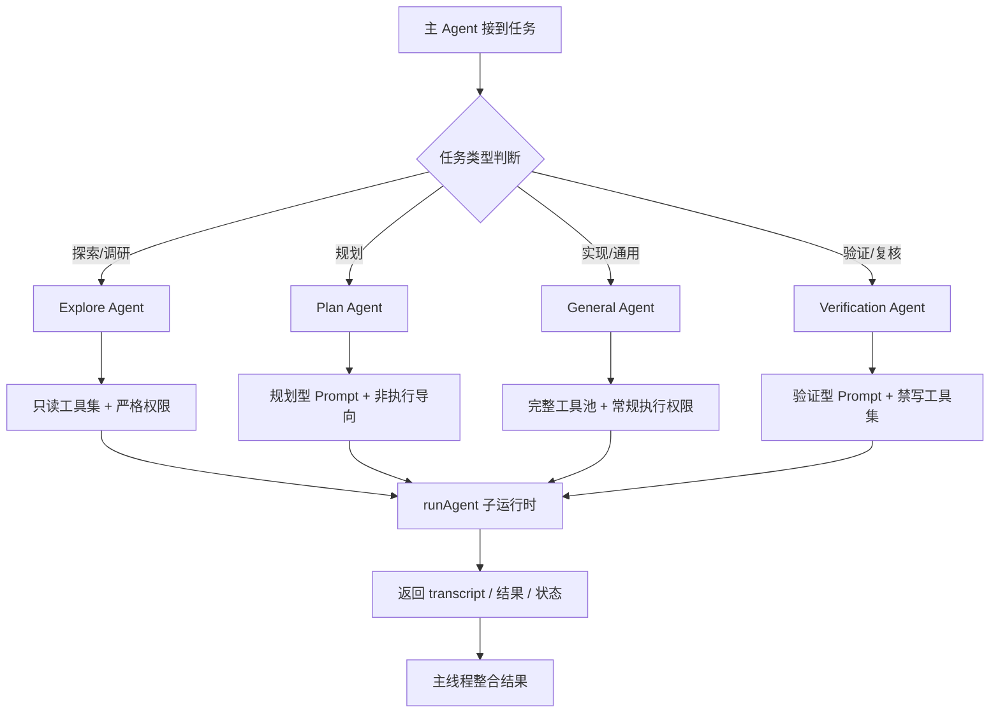
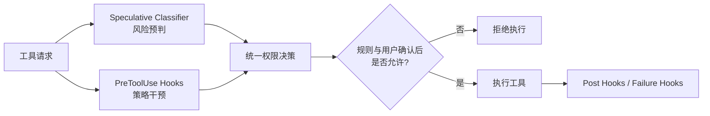
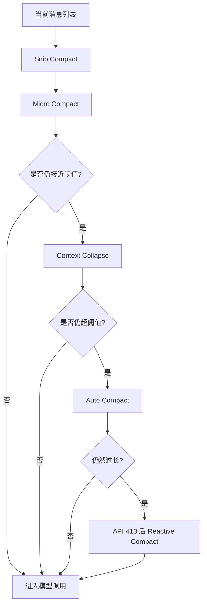
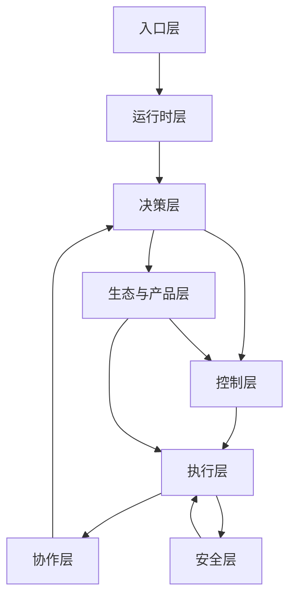

# Claude Code 核心思想、运转流程与实现原理总结

> 基于《Claude Code 源码架构深度解析 V2.0》整理。
> 原 PDF 核心范围覆盖：入口层、主循环、Prompt 编排、工具执行、多 Agent、权限安全、Skill/Plugin/MCP、上下文压缩、产品化运行时。

---

## 1. 一句话结论

Claude Code 的本质不是“带几个工具的 CLI”，而是一个 **面向编码任务的 Agent Operating System**：

- 以 **状态机主循环** 作为统一运行内核
- 以 **Prompt 编排 + 工具治理流水线** 约束模型行为
- 以 **多 Agent 分工** 提升探索、实现、验证的可靠性
- 以 **权限 / Hook / 分类器** 构成安全防护网
- 以 **Skill / Plugin / MCP** 构成可扩展生态
- 以 **上下文压缩 / cache / token budget** 控制成本与长任务可持续性
- 以 **任务生命周期、状态管理、桥接和遥测** 实现产品化落地

换句话说：**Claude Code 不是“模型直接写代码”，而是“模型被一个工程化运行时严格组织起来去做代码工作”。**

---

## 2. Claude Code 的整体核心思想

## 2.1 从“模型能力”转向“系统能力”

Claude Code 并不把能力押注在模型临场发挥上，而是把大量关键行为沉淀为系统机制：

1. **行为制度化**  
   把“先读代码再改代码”“不要擅自扩展需求”“不要乱建文件”“不要谎报结果”等规则直接写进 system prompt。

2. **工具调用治理化**  
   工具不是模型想调就调，而是要经过：输入校验、风险预判、Hook、权限决策、执行、后处理、失败处理。

3. **角色拆分化**  
   让 Explore、Plan、Verify 等不同 Agent 分工，而不是让一个 Agent 同时“研究 + 实现 + 验证”。

4. **上下文预算化**  
   Token 被视为预算，不是无限资源；上下文要缓存、压缩、裁剪、按需注入。

5. **安全分层化**  
   把风险判断、策略拦截、最终权限决策拆成多层，并明确规定互不绕过。

6. **生态模型可感知化**  
   Skill、Plugin、MCP 不只是接进系统，更要让模型知道自己现在具备哪些能力、什么时候该用。

---

## 2.2 核心设计哲学

可以把它概括为 7 条：

- **不信任模型的自觉性**：好行为要写成制度。
- **把角色拆开**：探索、实现、验证分离。
- **工具调用必须受治理**：工具是执行面，不是模型直连面。
- **上下文就是预算**：缓存、压缩、按需加载优先。
- **安全层必须互不绕过**：Hook 不能跳过 deny 规则。
- **生态的关键是模型感知**：模型必须“知道自己有什么能力”。
- **产品化在于处理第二天**：能恢复、能清理、能追踪、能续跑，才不是 demo。

---

## 3. Claude Code 的整体架构

```mermaid
flowchart TB
    A[用户入口\nCLI / MCP / SDK / IDE] --> B[入口分发层\nfast-path + dynamic import]
    B --> C[主应用 main.tsx\n初始化状态/工具/上下文]
    C --> D[查询引擎 query.ts\nwhile(true) 状态机主循环]

    D --> E[上下文处理\ncompact / collapse / budget]
    E --> F[Prompt 编排\n静态区 + 动态区]
    F --> G[模型 API]
    G --> H[流式响应处理]

    H --> I[工具执行流水线\n校验/分类/Hook/权限/执行]
    I --> D

    D --> J[多 Agent 调度\nExplore / Plan / Verify / Fork]
    J --> D

    D --> K[生态扩展\nSkill / Plugin / MCP]
    K --> F
    K --> I

    I --> L[安全层\nClassifier + Hooks + Permissions]
    D --> M[产品化能力\nTasks / Bridge / State / Telemetry]
```

---

## 4. 运转流程：一个请求是怎么跑起来的

## 4.1 主链路

从用户输入到结果输出，主流程是：

1. `cli.tsx` 判断是否命中 fast-path
2. 未命中时进入 `main.tsx`
3. 初始化状态、工具注册、构造 `ToolUseContext`
4. 用户输入进入 `query()`
5. `query()` 进入 `queryLoop()` 的 `while(true)` 主循环
6. 每一轮执行：
   - 上下文压缩
   - 组装 system prompt
   - 调用模型 API
   - 流式接收输出
   - 发现工具调用则执行工具
   - 注入工具结果、memory、skills、commands
   - 判断是否继续下一轮

## 4.2 主循环流程图

```mermaid
flowchart TD
    A[用户输入] --> B[query()]
    B --> C[进入 queryLoop\nwhile true]
    C --> D[上下文预处理\nsnip/micro/collapse/auto compact]
    D --> E[Token 预算检查]
    E --> F[组装 system prompt + messages + tool defs]
    F --> G[调用模型 API]
    G --> H[流式接收响应]

    H --> I{是否出现 tool_use?}
    I -- 否 --> J[检查 stop hooks / token budget / 退出条件]
    I -- 是 --> K[StreamingToolExecutor 或 runTools]
    K --> L[注入 tool_result / memory / skill discovery / queued commands]
    L --> M[组装新消息列表]
    M --> C

    J --> N{是否继续?}
    N -- 是 --> C
    N -- 否 --> O[结束并返回]
```

---

## 5. 实现原理一：为什么主循环是状态机，而不是递归

Claude Code 的 `query.ts` 是整个系统的核心心跳。

它采用的是：

- `async generator`
- `while(true)` 主循环
- `state` 对象在轮次之间传递状态

这代表它把“一轮接一轮的 agent 推理与执行”抽象成 **状态迁移系统**。

### 这样设计的原因

### 1）避免长会话递归爆栈

如果每轮都递归调用自身，长任务、多轮工具调用、多次重试时，很容易堆栈过深。

### 2）更适合处理复杂继续条件

系统中存在多种“为什么要再跑一轮”的原因，例如：

- 下一轮工具调用
- reactive compact 重试
- output token 超限恢复
- stop hook 阻断后再继续
- token budget 驱动继续

这些场景本质上都适合建模成：

- 当前状态
- 触发条件
- 跳转到下一状态

### 3）更适合做异常恢复

状态机天然适合在某一阶段失败后，从中间恢复或重新进入下一轮，而不是把控制流绑死在函数调用栈里。

---

## 6. 实现原理二：Prompt 不是一段文本，而是一台拼装机器

Claude Code 的 Prompt 系统并不是单一大字符串，而是 **分段、可缓存、可按状态注入** 的拼装机制。

## 6.1 Prompt 的两大区块

### 静态部分（倾向缓存）

包括：

- 身份定位
- 系统运行规范
- 做任务行为规范
- 风险动作规范
- 工具使用语法
- 语气与风格
- 输出效率要求

### 动态部分（按会话状态注入）

包括：

- 当前 session guidance
- memory（如 `CLAUDE.md`）
- 环境信息（OS、shell、cwd、模型）
- 语言偏好
- MCP server instructions
- function result clearing 说明
- token budget 说明

两者之间通过 `SYSTEM_PROMPT_DYNAMIC_BOUNDARY` 分隔。

## 6.2 关键意义

这不是简单的排版优化，而是 **Prompt Cache 经济学**：

- 静态前缀尽可能字节级一致
- 动态内容放在后半段
- 这样 API 层就更容易命中前缀缓存
- 命中缓存意味着更低成本、更低延迟

### 结论

Claude Code 的 prompt 设计目标不是“写得全面”，而是：

- 行为约束足够强
- 变化范围尽量局部化
- 缓存利用最大化

---

## 7. 实现原理三：工具系统不是函数调用，而是受治理的执行总线

Claude Code 的工具系统是整个执行面的骨架。

## 7.1 Tool 接口的本质

一个 Tool 不只是：

- 名称
- 输入
- 输出

而是包含：

- `call()`：执行
- `inputSchema`：结构校验
- `validateInput()`：更细粒度校验
- `checkPermissions()`：权限检查
- `preparePermissionMatcher()`：权限匹配预处理
- `isReadOnly()` / `isDestructive()` / `isConcurrencySafe()`：行为属性
- `prompt()`：动态描述自身如何被模型使用
- 多类 render 方法：控制调用中、完成、失败、拒绝等 UI 展示

这意味着工具被设计成 **带治理元数据的执行单元**。

## 7.2 fail-closed 默认哲学

Claude Code 在工具默认值上采用保守策略：

- 没声明并发安全 => 默认不安全
- 没声明只读 => 默认可能写入

这是一种典型的 **fail-closed** 设计：

> 配置缺失时，默认更严格，不默认放行。

---

## 7.3 工具执行流水线

```mermaid
flowchart TD
    A[模型发起 tool_use] --> B[按名称/别名定位 Tool]
    B --> C[解析 MCP 元数据]
    C --> D[Zod Schema 校验]
    D --> E[validateInput 细粒度校验]
    E --> F[Speculative Classifier\n尤其 Bash 风险预判]
    F --> G[执行 PreToolUse Hooks]
    G --> H[解析 Hook 返回\nallow/ask/deny/updatedInput]
    H --> I[统一权限决策\n规则 + Hook + 用户交互]
    I --> J{允许执行?}
    J -- 否 --> K[返回拒绝/错误结果]
    J -- 是 --> L[执行 tool.call()]
    L --> M[记录 tracing / analytics / telemetry]
    M --> N[执行 PostToolUse Hooks]
    N --> O[构造结构化 tool_result]
    O --> P[返回主循环]

    L --> Q{执行失败?}
    Q -- 是 --> R[PostToolUseFailure Hooks]
    R --> P
```

## 7.4 这条流水线解决了什么问题

它解决的不是“工具能不能用”，而是“工具在高风险、不完整输入、复杂权限、可追踪场景下，是否仍能稳定可控地被使用”。

因此 Claude Code 的工具层本质上是：

- **执行总线**
- **风险网关**
- **可观测节点**

---

## 8. 实现原理四：Streaming Tool Execution 把等待时间折叠掉

传统模式：

- 模型先完整输出所有内容
- 等所有 `tool_use` 收齐
- 再统一执行工具

Claude Code 的做法：

- 模型流式输出时
- 某个 `tool_use block` 一旦完整
- 就立即启动对应工具执行

### 价值

1. **降低总等待时间**  
   前面工具可以和后面 token 生成重叠执行。

2. **改善用户感知速度**  
   用户更快看到“系统已经开始干活”。

3. **提高长链路吞吐**  
   多工具场景下，模型生成和工具执行并行化更充分。

所以这里的关键不是“边收边跑”这个技巧本身，而是：

> Claude Code 在运行时层面把模型输出阶段和工具执行阶段做了时间重叠优化。

---

## 9. 实现原理五：多 Agent 不是并发堆砌，而是职责拆分

Claude Code 内建多个 Agent，典型包括：

- General Purpose Agent
- Explore Agent
- Plan Agent
- Verification Agent
- Guide Agent
- Statusline Setup Agent

## 9.1 多 Agent 的根本目的

不是为了“显得高级”，而是因为单个 Agent 同时承担：

- 研究
- 规划
- 实现
- 验证

会天然产生偏差：

- 探索时可能误修改
- 实现时容易过度乐观
- 验证时容易偏向“自己觉得没问题”

### 所以 Claude Code 的解法是：

**把任务角色拆成不同运行人格，每个角色只拿到完成自己职责所需的 prompt、工具和权限。**

---

## 9.2 典型角色

### Explore Agent

定位：只读代码探索专家。

特点：

- 禁止创建/修改/删除文件
- Bash 仅允许只读类命令
- 更强调扫描与理解，而不是执行
- 为了速度和成本，默认可使用更轻模型

### Plan Agent

定位：规划者。

特点：

- 强调拆解方案、列步骤、不给执行副作用

### Verification Agent

定位：对抗式验证者。

特点：

- 核心目标不是证明实现“看起来对”，而是 **试图把它搞坏**
- 强调实际执行验证动作
- 必须记录真实命令与观察结果
- 输出 PASS / FAIL / PARTIAL

## 9.3 多 Agent 调度流程图



---

## 10. 实现原理六：安全层不是单点判断，而是三层防护网

Claude Code 的安全体系并不是“弹一次确认框”这么简单，而是 3 层协同。

## 10.1 三层结构

### 第一层：Speculative Classifier

主要用于 Bash 风险预判。

特点：

- 在正式权限判断前提前异步分析风险
- 与 Hook 可并行进行
- 作用是降低后续权限决策等待时间

### 第二层：Hook Policy Layer

PreToolUse / PostToolUse / PostToolUseFailure。

Hook 不只是日志点，它可以：

- allow / ask / deny
- 修改输入
- 阻断流程
- 注入额外上下文
- 修改 MCP 输出

### 第三层：Permission Decision

最终权限决策层，综合：

- 配置规则
- Hook 结果
- 用户交互
- 工具自身权限要求

## 10.2 最关键的安全原则

**任一层都不能绕过另一层。**

特别是：

- Hook 的 `allow` 不能覆盖 settings 里的 `deny`
- Hook 的 `allow` 也不必然跳过 `ask`
- Hook 的 `deny` 可以直接阻断

这意味着安全模型的控制权始终掌握在统一权限系统中，而不是分散给各个扩展点。

## 10.3 安全层流程图



---

## 11. 实现原理七：生态扩展的重点不只是“接入”，而是“被模型感知”

Claude Code 的生态核心包括：

- **Skill**：带 frontmatter 元数据的 workflow package
- **Plugin**：能修改模型行为、命令、hook、样式、MCP 配置的扩展包
- **MCP**：工具桥，同时能向 prompt 注入工具使用说明

## 11.1 为什么“感知”比“接入”更重要

很多系统的扩展失败，不是因为接不进去，而是因为：

- 模型不知道它已连接
- 模型不知道何时使用
- 模型不知道使用规则

Claude Code 的做法是让扩展能力通过多个渠道进入模型视野：

- skills 列表
- agent 列表
- session-specific guidance
- MCP instructions
- command integration

### 本质上是：

> 不只是扩展运行时能力，更是扩展模型的“自我能力认知”。

---

## 12. 实现原理八：上下文管理就是成本管理

Claude Code 非常明确地把 token 当成预算，而不是模糊资源。

## 12.1 四道压缩机制

在每轮模型调用前，消息会依次经过：

1. **Snip Compact**：裁掉历史中过长部分
2. **Micro Compact**：细粒度压缩
3. **Context Collapse**：把不活跃区域折叠为摘要
4. **Auto Compact**：接近阈值时做重压缩

策略是：

- 先轻压缩
- 再重压缩
- 能不做全量压缩就不做

## 12.2 413 的兜底：Reactive Compact

若压缩后仍超限，API 返回 413，则触发紧急压缩后重试。

同时通过标记避免无限循环重试。

## 12.3 其他优化手段

- Skill 按需注入
- MCP instructions 按连接状态注入
- Memory prefetch
- Skill discovery prefetch
- Tool result budget：大型工具结果落盘，只保留摘要进上下文

## 12.4 上下文压缩流程图



---

## 13. 实现原理九：产品化能力决定它是不是“真的可用”

Claude Code 的工程成熟度，体现在它考虑了大量“第二天问题”：

- 任务中断如何续跑
- 子 Agent transcript 如何记录
- shell 进程如何清理
- MCP 连接如何释放
- 脏状态如何回收
- IDE / 远程容器如何桥接
- 全局状态如何统一管理
- 成本、性能、限流如何观测

## 13.1 关键产品化模块

### Task System

支持：

- 前台/后台 agent 任务
- 本地/远程 agent 任务
- shell 任务
- 可 abort、可通知回主线程

### Bridge

支持：

- 本地 CLI
- IDE 插件
- 远程控制 / bridge 模式
- 运行时桥接

### State

统一管理：

- 权限模式
- 工具配置
- MCP 连接
- effort 设置
- 运行时全局状态

### Telemetry

包括：

- tracing
- OTel
- 成本追踪
- rate limit 管理

### 结论

Claude Code 之所以像一个完整产品，而不是一个研究原型，是因为它已经把“运行后的运维问题”纳入核心设计。

---

## 14. 你可以如何理解 Claude Code 的完整工作模型

可以把它理解成 8 层：

1. **入口层**：CLI / MCP / SDK / IDE
2. **运行时层**：main.tsx 初始化与状态装配
3. **决策层**：query.ts 状态机主循环
4. **控制层**：Prompt 编排 + 行为约束
5. **执行层**：工具系统 + 工具治理流水线
6. **协作层**：多 Agent 分工与调度
7. **安全层**：classifier + hooks + permissions
8. **生态与产品层**：skills / plugins / MCP / tasks / bridge / telemetry



---

## 15. 最终总结：Claude Code 的真正先进点在哪里

Claude Code 的先进点不在于“有很多工具”或“支持多 Agent”本身，而在于它把这些东西组织成了一个完整的、可持续运行的系统。

### 它真正领先的地方在于：

1. **把 LLM 变成受约束的工程执行体，而不是自由发挥的聊天体**
2. **把一次次推理与工具调用组织成状态机驱动的运行时**
3. **把工具调用做成具备权限、安全、观测、失败处理的治理流水线**
4. **把多 Agent 设计成职责分离，而不是简单并发**
5. **把 Prompt 设计成可缓存、可拼装、可动态注入的系统部件**
6. **把 Skill/Plugin/MCP 做成模型可感知的能力扩展生态**
7. **把 token、生命周期、清理、恢复、桥接、追踪都纳入产品级设计**

### 最准确的定位

**Claude Code = 一个以状态机主循环为核心、以 Prompt 与工具治理为控制面、以多 Agent 与安全体系为执行保障、以生态扩展与产品化运行时为外延的 Agent OS。**

---

## 16. 对你研究 Agent / Code Agent 的启发

如果你要借鉴 Claude Code 的思路，最值得复用的不是表面功能，而是下面这组架构模式：

### 必学 1：主循环状态机

不要写成“模型调一次、工具跑一次”的线性脚本，要写成可继续、可恢复、可重试的状态机。

### 必学 2：工具治理流水线

工具执行必须有：

- schema 校验
- 权限检查
- 风险分类
- hook 策略
- tracing
- 成功/失败后处理

### 必学 3：角色分工

至少把：

- Explore
- Implement
- Verify

分开。

### 必学 4：Prompt 分层与缓存友好设计

把稳定内容前置，把动态内容后置，明确边界，提升缓存命中率。

### 必学 5：安全层互不绕过

不要把所有安全都押在单点确认框上。

### 必学 6：上下文预算意识

长任务系统一定要做压缩、裁剪、摘要化、按需注入。

### 必学 7：先想“第二天”

任何 Agent 系统都应优先回答：

- 任务怎么恢复？
- 进程怎么清理？
- 状态怎么追踪？
- 成本怎么统计？
- 插件怎么接入又不失控？

---

## 17. 参考来源

- 原始文档：《Claude Code 源码架构深度解析 V2.0》
- 版本日期：2026-04-01
- 说明：本文为基于原 PDF 的结构化整理与总结，重点提炼 Claude Code 的整体核心思想、运行流程与实现原理。
