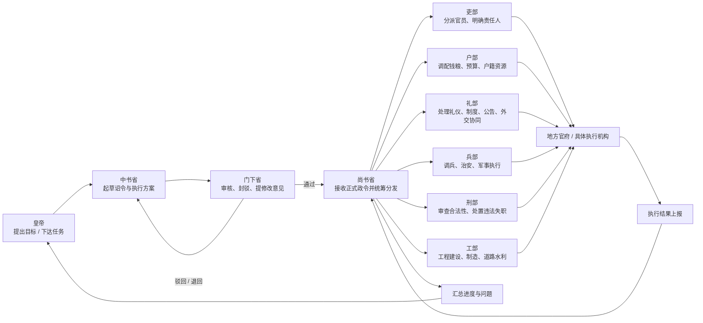
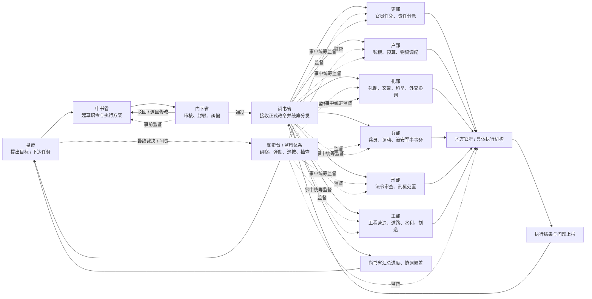

```mermaid
flowchart LR
    A["皇帝<br/>提出目标 / 下达任务"] --> B["中书省<br/>起草诏令与执行方案"]
    B --> C["门下省<br/>审核、封驳、提修改意见"]

    C -->|"通过"| D["尚书省<br/>接收正式政令并统筹分发"]
    C -->|"驳回 / 退回"| B

    D --> E1["吏部<br/>分派官员、明确责任人"]
    D --> E2["户部<br/>调配钱粮、预算、户籍资源"]
    D --> E3["礼部<br/>处理礼仪、制度、公告、外交协同"]
    D --> E4["兵部<br/>调兵、治安、军事执行"]
    D --> E5["刑部<br/>审查合法性、处置违法失职"]
    D --> E6["工部<br/>工程建设、制造、道路水利"]

    E1 --> F["地方官府 / 具体执行机构"]
    E2 --> F
    E3 --> F
    E4 --> F
    E5 --> F
    E6 --> F

    F --> G["执行结果上报"]
    G --> D
    D --> H["汇总进度与问题"]
    H --> A

```

```mermaid
flowchart LR
    A["皇帝<br/>提出目标 / 下达任务"] --> B["中书省<br/>起草诏令与执行方案"]
    B --> C["门下省<br/>审核、封驳、纠偏"]

    C -->|"通过"| D["尚书省<br/>接收正式政令并统筹分发"]
    C -->|"驳回 / 退回修改"| B

    D --> E1["吏部<br/>官员任免、责任分派"]
    D --> E2["户部<br/>钱粮、预算、物资调配"]
    D --> E3["礼部<br/>礼制、文告、科举、外交协调"]
    D --> E4["兵部<br/>兵员、调动、治安军事事务"]
    D --> E5["刑部<br/>法令审查、刑狱处置"]
    D --> E6["工部<br/>工程营造、道路、水利、制造"]

    E1 --> F["地方官府 / 具体执行机构"]
    E2 --> F
    E3 --> F
    E4 --> F
    E5 --> F
    E6 --> F

    F --> G["执行结果与问题上报"]
    G --> D
    D --> H["尚书省汇总进度、协调偏差"]
    H --> A

    J["御史台 / 监察体系<br/>纠察、弹劾、巡按、抽查"] -.监督.-> E1
    J -.监督.-> E2
    J -.监督.-> E3
    J -.监督.-> E4
    J -.监督.-> E5
    J -.监督.-> E6
    J -.监督.-> F
    J --> A

    C -.事前监督.-> B
    D -.事中统筹监督.-> E1
    D -.事中统筹监督.-> E2
    D -.事中统筹监督.-> E3
    D -.事中统筹监督.-> E4
    D -.事中统筹监督.-> E5
    D -.事中统筹监督.-> E6
    A -.最终裁决 / 问责.-> J

```